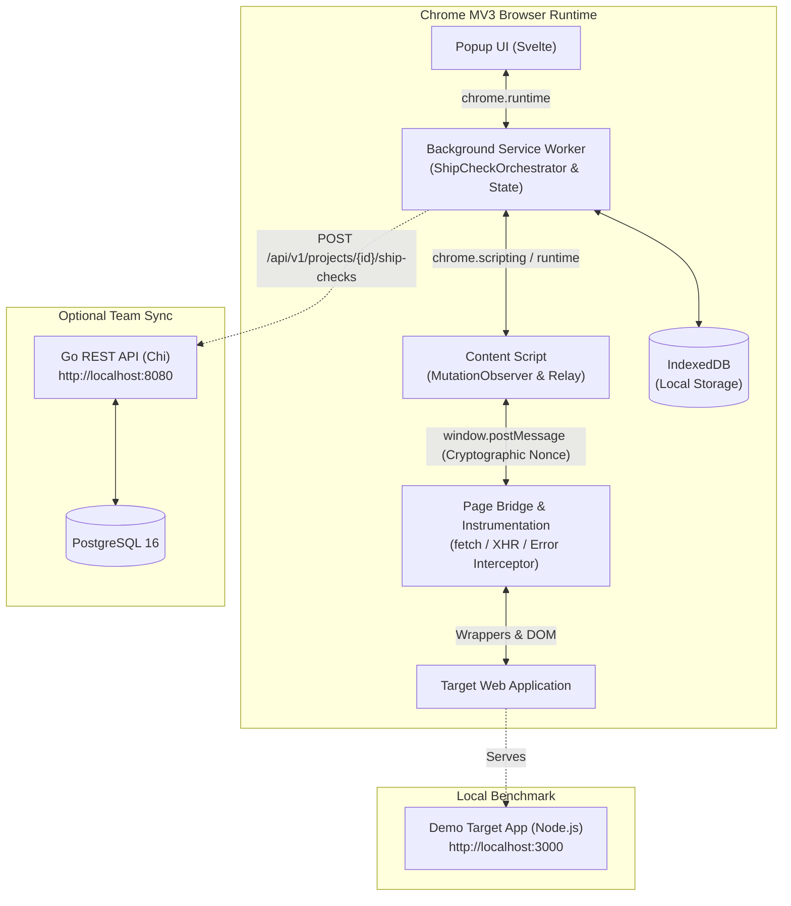

# HAVOC

### Audit your AI-built app before you ship it.

AI coding tools and vibe-coding workflows allow engineers to build web applications at unprecedented speed. But rapid iteration often skips resilience fundamentals: what happens when an API endpoint times out, a backend 500s, an input field is fuzzed, or a user opens your dashboard on a narrow screen?

HAVOC is an **in-browser pre-ship resilience audit tool**. It subjects your running web application to controlled, realistic disruptions, gathers technical evidence across isolated execution contexts, and produces deterministic, LLM-ready fix prompts to immediately patch surfaced flaws.

---

## Current Status

✅ **V1 complete and verified end-to-end**
- Chrome Manifest V3 extension with isolated service worker, content script, and page bridge.
- Autonomous six-phase Ship Check suite with deterministic remediation engine.
- Fully wired Node.js demonstration target app with broken and fixed benchmark modes.
- Go REST API (`havoc-api`) and PostgreSQL 16 persistence for team report sync.
- 100% passing automated test suite (extension Vitest, Go integration, and demo app smoke tests).

---

## The Six Ship Checks

HAVOC runs an autonomous battery of active disruptions and passive inspections directly within your active browser tab:

| Check | Product Scope | What It Evaluates |
| :--- | :--- | :--- |
| **Testing API failures** | `fetch_failure` | Intercepts `fetch`/XHR and simulates network drops, timeouts, and 500/503 errors. Flags missing error states, infinite spinners, and lack of retry paths. |
| **Testing slow API responses** | `fetch_latency` | Injects controlled latency delays (2.5s–3.0s) into outgoing requests to verify loading skeletons, spinner feedback, and disabled button states. |
| **Testing form inputs** | `input_stress` | Non-destructively fuzzes inputs with edge-case characters, unicode, emojis, and boundary strings to catch unhandled client-side exceptions. |
| **Checking for runtime errors** | `runtime_errors` | Passively captures uncaught JavaScript exceptions (`window.onerror`) and unhandled promise rejections on the page. |
| **Scanning for exposed secrets** | `secret_scan` | Inspects client DOM, scripts, and bundles for leaked API keys, tokens, and private credentials (e.g. Stripe, AWS, GitHub). |
| **Testing narrow screens** | `viewport_stress` | Dynamically applies responsive viewport constraints (320px / 280px) to surface horizontal layout overflow and clipped controls. |

---

## Quickstart

Run a complete audit in under 3 minutes using the bundled demo application:

### 1. Build the Extension
```bash
# From repo root:
npm install --prefix extension
npm run build --prefix extension
```

### 2. Load Extension into Chrome
1. Open Google Chrome and go to `chrome://extensions`.
2. Enable **Developer mode** (top right).
3. Click **Load unpacked** and select the directory:
   ```
   <repo-root>/extension/dist
   ```
4. Pin the **HAVOC** extension icon in your Chrome toolbar.

### 3. Start the Demo Application
In a separate terminal, launch the demo application configured in **broken** mode:
```bash
npm run demo:broken --prefix demo-app
```
*The demo application is now live at `http://localhost:3000`.*

### 4. Run the Ship Check
1. In Chrome, navigate to `http://localhost:3000/?mode=broken`.
2. Click the **HAVOC** extension icon to open the popup.
3. Click **Start Ship Check**.
4. Watch HAVOC autonomously execute the six check phases.
5. Inspect the **Results** and click any finding to open the **Autopsy** screen with technical evidence and an LLM-ready fix prompt.
6. Switch to `http://localhost:3000/?mode=fixed` and re-run to verify that all checks reach `READY` status!

---

## Architecture



---

## Evidence-Based Remediation (No LLM in the Loop)

HAVOC does not manufacture opinions or rely on flaky LLM inference to decide whether an application failed. Findings are derived strictly through a causal pipeline:

$$\text{Raw Events} \xrightarrow{\quad} \text{Synthesized Signals} \xrightarrow{\quad} \text{Evidence-Backed Finding} \xrightarrow{\quad} \text{Actionable Remediation}$$

Remediations are generated deterministically by [`remediation-engine.ts`](extension/src/background/engine/remediation-engine.ts) from concrete evidence (exact URLs, status codes, line numbers, and DOM selectors), producing clean, copy-pasteable instructions ready for AI coding assistants.

---

## Repository Scripts

Convenience scripts available at the repository root:

| Command | Purpose |
| :--- | :--- |
| `npm run build:extension` | Build extension and execute `verify-build` check |
| `npm run test:extension` | Run complete Vitest suite for extension |
| `npm run test:backend` | Run Go unit and API tests in `backend/` |
| `npm run test:demo` | Run Node.js smoke tests for `demo-app/` |
| `npm run demo` | Start demo app server on port 3000 |
| `npm run demo:broken` | Start demo app server forced into broken mode |
| `npm run demo:fixed` | Start demo app server forced into fixed mode |

---

## Detailed Documentation

- **[Architecture & Domain Model](docs/ARCHITECTURE.md)**: Full runtime chain, MV3 isolation layers, state machines, and data models.
- **[Extension Setup & Build Constraints](docs/EXTENSION_SETUP.md)**: Detailed build mechanics, standalone IIFE constraints, and `verify-build` enforcement.
- **[Ship Check Suite Reference](docs/SHIP_CHECKS.md)**: Comprehensive breakdown of all 6 checks, evidence capture, and remediation logic.
- **[Demo Application Guide](docs/DEMO_APP.md)**: Deep dive into the 6 planted flaws, source locations, and benchmark modes.
- **[Go Backend & PostgreSQL](docs/BACKEND.md)**: API routes, Docker Compose setup, configuration, and integration testing.
- **[End-to-End Demonstration Guide](docs/END_TO_END_DEMO.md)**: Complete step-by-step walkthrough across the extension, demo app, and backend sync.

---

## License

See [LICENSE](LICENSE) for terms of use.
