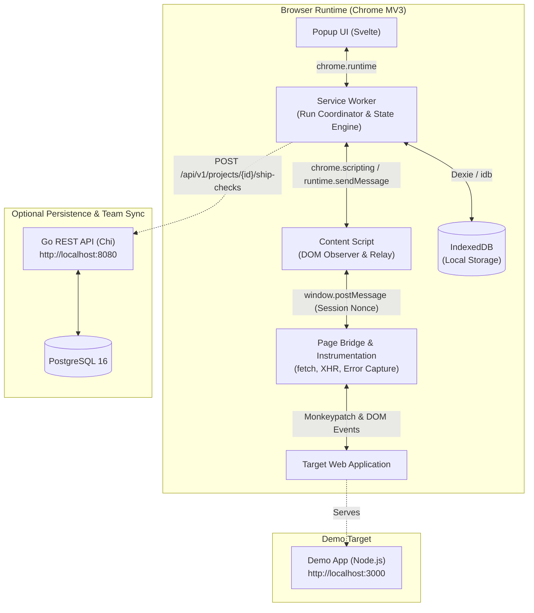
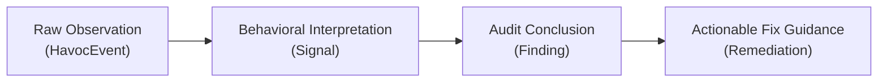

# HAVOC Architecture

HAVOC is an evidence-driven browser resilience and pre-ship audit platform. It injects bounded, controlled disruptions into running web applications, observes runtime behavior across isolated execution contexts, and produces deterministic, evidence-backed findings and copyable fix prompts.

---

## High-Level System Architecture



---

## Extension Execution Model & Boundaries

HAVOC V1 runs as a Chrome Manifest V3 extension. In compliance with MV3 security constraints and page isolation rules, execution is partitioned into four distinct layers:

```
┌─────────────────────────────────────────────────────────────┐
│ 1. Popup UI (Svelte 4 + TypeScript)                         │
│    - Ephemeral presentation layer (Lab Deck)                │
│    - Never owns execution state; binds reactively to SW     │
│    - Renders Home, Running, Results, and Autopsy screens    │
└──────────────────────────────┬──────────────────────────────┘
                               │ chrome.runtime.sendMessage
                               ▼
┌─────────────────────────────────────────────────────────────┐
│ 2. Background Service Worker (Privileged Extension Context) │
│    - ShipCheckOrchestrator: coordinates 6-phase test suite  │
│    - PassiveCheckRunner: executes read-only inspections     │
│    - ResourceRegistry: tracks and enforces LIFO cleanup     │
│    - Signal & Finding Engines: derives evidence & findings  │
│    - RemediationEngine: produces deterministic fix prompts  │
│    - Local Persistence: IndexedDB repository                │
│    - SyncClient: optional sanitized push to Go API          │
└──────────────────────────────┬──────────────────────────────┘
                               │ chrome.scripting.executeScript / runtime
                               ▼
┌─────────────────────────────────────────────────────────────┐
│ 3. Content Script (Isolated Extension World)                │
│    - Dynamically injected into target tab via executeScript │
│    - Bundled as a standalone IIFE classic script            │
│    - Runs MutationObserver for loading spinners & error text│
│    - Bridges messages between Service Worker & Page World   │
│    - Verifies session nonces on page-world messages         │
└──────────────────────────────┬──────────────────────────────┘
                               │ window.postMessage (with cryptographic nonce)
                               ▼
┌─────────────────────────────────────────────────────────────┐
│ 4. Page World Bridge & Instrumentation (Main Page Context)  │
│    - Injected into page DOM; bundled as standalone IIFE     │
│    - Wraps window.fetch and window.XMLHttpRequest           │
│    - Intercepts window.onerror and unhandledrejection       │
│    - Executes chaos directives (latency, synthetic errors,  │
│      form fuzzing, viewport constraints)                    │
│    - Emits sanitized REQUEST_OBSERVATION messages           │
└─────────────────────────────────────────────────────────────┘
```

---

## The Audit & Analysis Pipeline

HAVOC enforces a strict separation of concerns across the reasoning chain:

$$\text{Event} \xrightarrow{\quad} \text{Signal} \xrightarrow{\quad} \text{Finding} \xrightarrow{\quad} \text{Remediation}$$



1. **`HavocEvent` (Raw Observation)**:
   Immutable record of a concrete runtime occurrence (e.g. `REQUEST_STARTED`, `REQUEST_HTTP_FAILURE`, `DOM_MUTATION`, `RUNTIME_ERROR`).
2. **`Signal` (Behavioral Interpretation)**:
   Domain-level interpretation synthesized from one or more events within a time window (e.g. `LoadingStateDetected`, `PotentialErrorStateDetected`, `LayoutOverflowDetected`).
3. **`Finding` (Audit Conclusion)**:
   Evidence-backed assessment with assigned severity (`HIGH`, `MEDIUM`, `LOW`, `INFO`), confidence score (0.00–1.00), and links to supporting events/signals.
4. **`Remediation` (Actionable Fix Guidance)**:
   Deterministic rule-based output structured into:
   - **What Happened**: Plain-language breakdown of the failure.
   - **Why It Matters**: User experience and business impact.
   - **How To Fix**: Concrete engineering steps to resolve the root issue.
   - **Fix Prompt**: A clean, context-rich prompt formatted for copy-pasting directly into AI coding agents.

---

## Domain Model Reference

The core domain contracts live in [`extension/src/domain/`](file:///d:/Abhiix0/Flagship%20Projects/Havoc/Havoc/extension/src/domain/):

| Type | File | Description |
| :--- | :--- | :--- |
| `ShipCheckRun` | [`ship-check.ts`](file:///d:/Abhiix0/Flagship%20Projects/Havoc/Havoc/extension/src/domain/ship-check.ts) | Root execution container for an audit run, containing target info, 6 execution steps, terminal readiness state, and sync status. |
| `ReadinessState` | [`ship-check.ts`](file:///d:/Abhiix0/Flagship%20Projects/Havoc/Havoc/extension/src/domain/ship-check.ts) | Overall status: `READY` (all checks passed), `NEEDS_ATTENTION` (medium/low findings), `BLOCKED` (critical high-severity findings), or `UNKNOWN`. |
| `Remediation` | [`remediation.ts`](file:///d:/Abhiix0/Flagship%20Projects/Havoc/Havoc/extension/src/domain/remediation.ts) | Deterministic remediation guidance linked to a specific `Finding` and `ShipCheckRun`. |
| `PassiveCheckRun` | [`passive-check.ts`](file:///d:/Abhiix0/Flagship%20Projects/Havoc/Havoc/extension/src/domain/passive-check.ts) | Read-only check run (`runtime_errors`, `secret_scan`) that evaluates the page without injecting active chaos. |
| `ExperimentDefinition` | [`experiment.ts`](file:///d:/Abhiix0/Flagship%20Projects/Havoc/Havoc/extension/src/domain/experiment.ts) | Active disruptive experiment definition (`fetch_latency`, `fetch_failure`, `input_stress`, `viewport_stress`). |
| `HavocEvent` | [`event.ts`](file:///d:/Abhiix0/Flagship%20Projects/Havoc/Havoc/extension/src/domain/event.ts) | Fine-grained telemetry event tagged with sequence, runId, timestamps, and resource metadata. |
| `Signal` | [`signal.ts`](file:///d:/Abhiix0/Flagship%20Projects/Havoc/Havoc/extension/src/domain/signal.ts) | Inferred pattern with causal back-references to source events. |
| `Finding` | [`finding.ts`](file:///d:/Abhiix0/Flagship%20Projects/Havoc/Havoc/extension/src/domain/finding.ts) | Final issue surfaced to the user with severity, confidence, and description. |
| `Recovery` | [`recovery.ts`](file:///d:/Abhiix0/Flagship%20Projects/Havoc/Havoc/extension/src/domain/recovery.ts) | Evaluates application recovery outcome: `RECOVERED`, `DEGRADED`, `FAILED`, or `UNKNOWN`. |
| `SyncPayload` | [`sync-payload.ts`](file:///d:/Abhiix0/Flagship%20Projects/Havoc/Havoc/extension/src/domain/sync-payload.ts) | Sanitized, redacted data transfer object transmitted to the Go backend API. |

---

## Local Storage & Retention

The extension uses IndexedDB via Dexie.js (`havoc_db`) to store:
- `ship_checks`
- `runs` (individual step runs)
- `events`
- `signals`
- `findings`
- `remediations`
- `recoveries`

Retention policies run automatically to prevent unbound storage growth. Cascade deletion cleanly evicts older runs and their dependent telemetry, findings, and remediations.

---

## Backend & Sync Pipeline

HAVOC operates entirely standalone in the browser. When a team or user enables backend sync in the extension settings:
1. At the completion of a Ship Check, `SyncClient` serializes the run, steps, findings, and remediations into a `SyncPayload`.
2. URL paths and query strings are sanitized; sensitive values detected during secret scanning are masked and redacted prior to transmission.
3. The payload is sent via `POST /api/v1/projects/{projectId}/ship-checks` to the Go backend.
4. The Go API validates and stores the report transactionally in PostgreSQL for long-term historical tracking and auditing.
