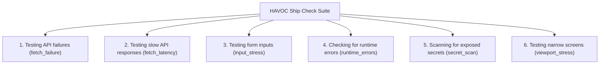

# HAVOC Ship Check Suite Reference

HAVOC Ship Checks evaluate web applications across six critical resilience and security dimensions before shipping to production.

Ship Checks combine **active bounded chaos injection** and **passive observational scanning**. Every finding is backed by causal technical evidence, assigned a severity and confidence score, and mapped to a deterministic, LLM-ready fix prompt.

> **Note on Remediation Generation**: HAVOC uses a 100% deterministic, rule-based templating engine ([`remediation-engine.ts`](file:///d:/Abhiix0/Flagship%20Projects/Havoc/Havoc/extension/src/background/engine/remediation-engine.ts)) grounded directly in captured runtime evidence and event metadata. It does **not** rely on external LLM calls or cloud inference to produce remediation text.

---

## The Six Ship Checks

---

### 1. Testing API Failures (`fetch_failure`)
- **Category**: Active Chaos Experiment
- **What It Does**: Intercepts outgoing `window.fetch` and `XMLHttpRequest` calls and injects simulated failures:
  - `transport_error` (network disconnection / TypeError)
  - `synthetic_http_error` (HTTP 500, 503)
  - `synthetic_timeout` (aborted requests after timeout)
- **Evidence Gathered**:
  - `REQUEST_HTTP_FAILURE`, `REQUEST_TRANSPORT_FAILURE`, `REQUEST_TIMEOUT`
  - DOM mutations during and after injection (loading indicator appearance/persistence)
  - Recovery evaluation: whether the app displayed an error banner, provided a retry path, or exited loading state.
- **What a Finding Means**: The application failed to recover gracefully from a backend failure—for example, freezing in an infinite spinner without giving the user feedback or a retry option.
- **Remediation**: Recommends error boundaries, reset of disabled states and spinners, and generates a structured fix prompt to implement retry logic and error banners.

---

### 2. Testing Slow API Responses (`fetch_latency`)
- **Category**: Active Chaos Experiment
- **What It Does**: Injects a controlled artificial delay (default: 3000ms) into outgoing network requests while observing application feedback.
- **Evidence Gathered**:
  - `REQUEST_STARTED` and delayed `REQUEST_COMPLETED`
  - `LoadingStateDetected`: heuristics looking for spinner classes (`.spinner`, `.loading`, `.skeleton`, `role="progressbar"`, `aria-busy`)
  - User feedback delays: time elapsed before the UI acknowledges the ongoing request.
- **What a Finding Means**: The UI appeared unresponsive or frozen during long-running network operations without visual loading feedback or disabled button states.
- **Remediation**: Recommends immediate skeleton/spinner display, debouncing duplicate triggers, and generating a fix prompt to enhance loading feedback.

---

### 3. Testing Form Inputs (`input_stress`)
- **Category**: Active Chaos Experiment
- **What It Does**: Identifies text inputs, textareas, and select elements on the page and non-destructively fuzzes them with boundary test vectors (extreme strings, unicode, emojis, whitespace, numeric bounds).
- **Evidence Gathered**:
  - `DOM_OBSERVATION` of input mutations and layout changes
  - JavaScript exceptions (`TypeError`, `RangeError`) triggered during `input` and `change` event dispatch
  - DOM error text nodes appearing in response to input.
- **What a Finding Means**: Client components crashed, threw uncaught exceptions, or entered corrupted states when handling unexpected string formats (e.g. naive string splitting or missing length checks).
- **Remediation**: Recommends client-side schema validation (e.g. Zod), input sanitization, and inline field validation messages.

---

### 4. Checking for Runtime Errors (`runtime_errors`)
- **Category**: Passive Observation Check
- **What It Does**: Arms error interception listeners on the target page (`window.addEventListener('error')` and `window.addEventListener('unhandledrejection')`) during page activity.
- **Evidence Gathered**:
  - `UNCAUGHT_EXCEPTION`: error message, sanitized script filename, line number, and column.
  - `UNHANDLED_REJECTION`: rejection reason and source trace.
  - Frequency and deduplication count within an active window.
- **What a Finding Means**: Real uncaught JavaScript errors or unhandled promise rejections occurred in page scripts, which can silently break user interactivity, buttons, and routing.
- **Remediation**: Points to the exact file and line number, recommending optional chaining (`?.`), null-coalescing (`??`), and component error boundaries.

---

### 5. Scanning for Exposed Secrets (`secret_scan`)
- **Category**: Passive Observation Check
- **What It Does**: Scans client-accessible inline scripts, DOM attributes, and public bundle text for high-confidence credential and API key regex patterns (e.g. Stripe secret keys, AWS access keys, GitHub tokens, private keys).
- **Evidence Gathered**:
  - `SECRET_PATTERN_MATCH`: matched pattern type (e.g. `stripe_secret_key`, `aws_access_key`), redacted matched preview (first/last characters only), and source script description.
- **What a Finding Means**: Private API secrets or private tokens were exposed in client-side code, allowing anyone inspecting network traffic or page source to view and extract them.
- **Remediation**: Recommends immediate revocation and rotation of the exposed key, migration to backend environment variables, and proxying client calls through authenticated server endpoints.

---

### 6. Testing Narrow Screens (`viewport_stress`)
- **Category**: Active Chaos Experiment
- **What It Does**: Temporarily injects viewport and container layout constraints (e.g. 320px mobile narrow mode, 280px squeeze mode) and triggers a window `resize` cycle to evaluate responsiveness.
- **Evidence Gathered**:
  - `layout_overflow_detected`: checks if `document.documentElement.scrollWidth > clientWidth + 4` (unwanted horizontal scrollbar).
  - Measurement of the overflow extent in pixels.
- **What a Finding Means**: The page contains fixed-width elements (such as wide data tables, images, or cards) that break mobile layouts and force horizontal scrolling.
- **Remediation**: Recommends CSS Flexbox/Grid responsive breakpoints, `overflow-x: auto` containment wrappers, and minimum tap targets.

---

## Readiness Status Outcomes

At the conclusion of a Ship Check, HAVOC evaluates all 6 checks and issues a terminal readiness status:

| Readiness | Tone | Condition |
| :--- | :--- | :--- |
| **`READY`** | Positive (Green) | All 6 checks completed with **0** findings. The application demonstrates solid resilience and recovery. |
| **`NEEDS_ATTENTION`** | Warning (Amber) | Only `MEDIUM` or `LOW` severity findings were identified (e.g. minor layout overflow or missing loading indicators). |
| **`BLOCKED`** | Critical (Red) | At least one **`HIGH`** severity finding was surfaced (e.g. exposed API secret, unhandled 500 error leaving UI frozen, or fatal script crash). |
| **`UNKNOWN`** | Neutral (Gray) | The audit was interrupted, target tab navigated away, or checks could not definitively establish status. |
